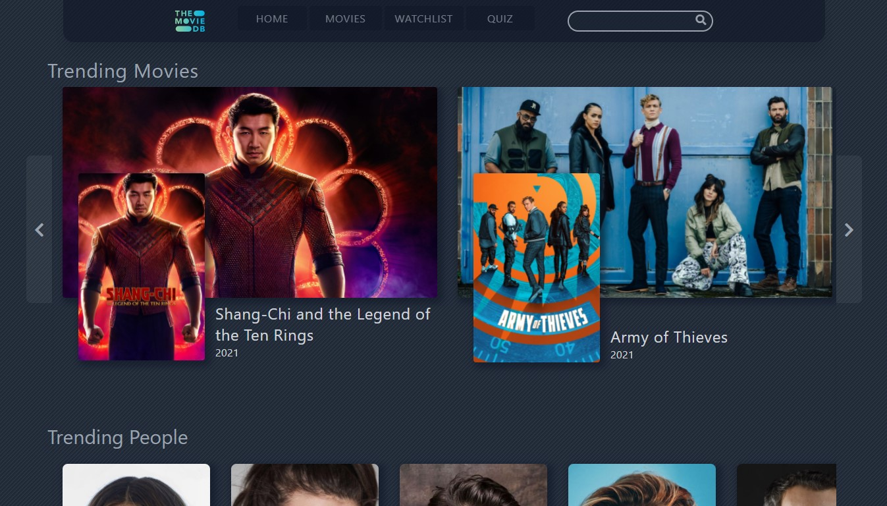

# ReactJS and TailwindCSS movie application project.

Movie database application using React and utilizing The Movie Database API to display movie and people data.

## Features

<ul>
  <li> Browse in depth information on movies and people, giving full cast details and history of work.</li>
  <li> Add or remove movies from a persistent watchlist for easy access anytime. </li>
  <li> Sort movies by date, revenue and rating. </li>
  <li> Filter movies by the minimum and maximum year of release as well as filter by inclusion of specified cast member.</li>
  <li> Fun mini quiz game that requires you to guess the film based on two actors who star in it. </li>
  <li> Search functionality that allows a search of any film or person with autocomplete suggestions. </li>
</ul>

## Libraries and Technologies
<ul>
  <li> Accesses The Movie Database (TMDB) API for movie and people data.</li>
  <li> Uses React and React Hooks. </li>
  <li> Implements Tailwind CSS for styling. </li>
  <li> Makes use of React Router for Routing.</li>
  <li> Uses icons from Font Awesome.</li>
</ul>

## Attribution
This product uses the TMDB API but is not endorsed or certified by TMDB.

This project was bootstrapped with [Create React App](https://github.com/facebook/create-react-app).
